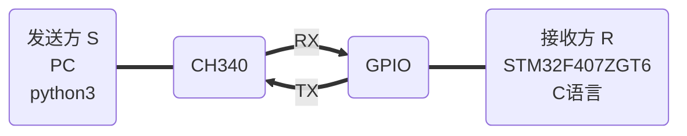

fork from: 

[framist/STemWinForHAL: 移植emWin与HAL库结合。(github.com)](https://github.com/framist/STemWinForHAL)

# 选择重发ARQ算法模拟 —— 基于真实硬件线路

[TOC]

##  实验要求

> 要求：写两个程序，一个发送方S一个接收方R。S程序从上层拿到数据包后要组装成帧，缓存、发送、定时，可以接收ACK应答，删除数据帧，停止定时器。R程序可以接收数据帧，回应ACK，上传数据帧到上层。S程序和R程序需要能模拟所有异常的处理过程，例如数据帧或ACK的丢失、损坏、超时。编程语言不做要求，软硬件平台也不做要求。要求程序可以正常运行，要求可以用输入和输出表明程序的成帧、流控、差控这三个功能。
>
> 时间：2021年12月31日23:59之前，统一汇总给课代表，copy给老师。
>
> 占分：总分10分。完成要求中基本功能可得1\~7分，如果程序有界面且能演示数据帧的发送、传输、异常处理等，额外加1\~3分。
>
>
> 原理示意图：
>
> 


## 实验原理


Figure 11.21  Selective Repeat ARQ, window size  窗口大小


选择性重传ARQ，发送和接收窗口必须小于等于$2^{m-1}$。

Algorithm 11.9  Sender-site Selective Repeat algorithm 发送方算法


Algorithm 11.10  Receiver-site Selective Repeat algorithm 接收方算法


Figure 11.23  Flow diagram for Example 11.8 帧丢失情况和NAK帧的情况


## 实现方案

### 实现平台

- 发送方S
  - python3 基于个人PC *x86_64 Windows 11*


- 接收方R
  - C语言 基于 STM32F407ZGT6 *32bit 无操作系统 ARM*

- 物理层和介质
  - 普通杜邦线 USB-TTL 串口 *波特率9600 字长8 停止1*



**Q: 为什么选择硬件实现？**

A: 因为在实际的生产生活中，任何基于算法的代码都是要依托于硬件进行实现的，通过硬件进行模拟我们可以手动干扰甚至切断传输线，模拟真实情况，可以从更接近生产的方式来体会算法的模拟


### 物理层

使用全双工串口作为物理层通讯协议

#### 通讯端口配置

接收方（下位机，C语言）

```c
//UART 初始化设置
UART1_Handler.Instance=USART1;					    //USART1
UART1_Handler.Init.BaudRate=bound;				    //波特率
UART1_Handler.Init.WordLength=UART_WORDLENGTH_8B;   //字长为8位数据格式
UART1_Handler.Init.StopBits=UART_STOPBITS_1;	    //一个停止位
UART1_Handler.Init.Parity=UART_PARITY_NONE;		    //无奇偶校验位
UART1_Handler.Init.HwFlowCtl=UART_HWCONTROL_NONE;   //无硬件流控
UART1_Handler.Init.Mode=UART_MODE_TX_RX;		    //收发模式
HAL_UART_Init(&UART1_Handler);					    //HAL_UART_Init()会使能UART1

HAL_UART_Receive_IT(&UART1_Handler, (u8 *)aRxBuffer, RXBUFFERSIZE);//该函数会开启接收中断：标志位UART_IT_RXNE，并且设置接收缓冲以及接收缓冲接收最大数据量
  
```

发送方（上位机，python）

```python
sl = show_serial()
port = 'COM' + input('找到串口：'+str(sl)+' 请输入串口号：COM') if len(sl) != 1 else sl[0]
baudrate = 9600
ser = serial.Serial(port, baudrate, timeout=0.5)
```


### 数据链路层

#### 接收方主逻辑

为方便调试，先实现接收方

为简化设计，部分采用了一点简化的办法

注意到这里发现书上的伪代码中多个错误，比如少了反括号和程序流程方面的错误

```python
# 选择性重传ARQ发送方算法
def ARQ_send(ser:serial.Serial):
    console = Console()
    console.print(Panel(' === Selective Repeat ARQ experiment ===\nby framsit'),justify='center')
    S_w = 2**4//2       # 8 注意这是窗口大小的两倍
    S_f = 0
    S_n = 0
    frames = ['']*S_w
    framesTime = [0]*S_w

    
    while True: # Repeat forever
        # frame = input('请输入发送(q退出)：')
        frame = console.input(Text('\n请输入发送(q退出)：',style='green bold'))
        if frame == '': 
            console.print('[!] 输入为空',style='red bold')
            continue
        if frame == 'q':  
            console.print(Panel(' === experiment end ==='),justify='center')
            break


        # 有包要发送
        if(abs(S_n - S_f) == S_w//2): # 窗口满
            console.print(Text('[!] 窗口满，等待空，丢弃输入',style='red bold'))
        else:
            # 发送
            frames[S_n] = frame
            SendFrame(ser,MakeFrame(frame,S_n))
            framesTime[S_n] = 0
            S_n += 1
            S_n %= S_w
        

        # 接收
        while True:
            read_frame = read_serial(ser)
            if corrupted(read_frame):
                console.print('[!] 接收到的数据有误或丢失',style='red bold')
            else:
                print('接收到数据正确:',read_frame)
                ackNo = int(read_frame[5],16)
                if read_frame[:3] == 'NAK' and isInWindow(ackNo+1,S_n,S_f,S_w):
                    console.print('接收到NAK，重传',style='yellow')
                    SendFrame(ser,MakeFrame(frames[ackNo],ackNo))
                    framesTime[ackNo] = 0
                    continue

                if read_frame[:3] == 'ACK': 
                    console.print(f'接收到ACK:{ackNo}',style='blue')
                    if isInWindow(ackNo,S_n,S_f,S_w):
                        while(ackNo != S_f):
                            frames[S_f] = '' # purge
                            framesTime[S_f] = 0
                            S_f += 1
                            S_f %= S_w

            # 超时 这里的时间抽象为经过循环的次数（方便测试）
            for i in range(S_w):
                if frames[i] != '':
                    if framesTime[i] > 4:
                        console.print(f'超时重传 No.{i}: {frames[i]}',style='yellow')
                        SendFrame(ser,MakeFrame(frames[i],i))
                        framesTime[i] = 0
                        break
                    else:
                        framesTime[i] += 1
            else:
                break # 都没要再发再接受的，退出接收循环

```


#### 发送方主逻辑

```c
int host_ARQ_R(void) {
    static int R_n = 0;
    static bool NakSent = FALSE;
    static bool AckNeeded = FALSE;

    char frame[USART_REC_LEN]; // [序列号][数据帧*n][校验字段][\r\n->\0] 可见字符空间
    static struct WINDOW window[WINDOW_SIZE] = {NULL,FALSE};

    // marked all solt = false
    // while(1) { 不用while因为外部有主循环
    
    if(_WaitForEvent(frame)) {         // 数据帧到达事件
        if(_corrupeted(frame) ) { // 这边书上的示例逻辑貌似也是错的
            if(! NakSent) _SendNAK(R_n);
            NakSent = TRUE;
            mainLogPrintf("\n corrupeted frame!");
            return 0;//sleep
        }
        if(_seqNo(frame) != R_n && (! NakSent) ){
            _SendNAK(R_n);
            NakSent = TRUE;
        } // 书上的伪代码中没有这个反括号
        if(TRUE &&(! window[_seqNo(frame)].f)){ //肯定in Window 因为取最大的窗口
            window[_seqNo(frame)].f = TRUE;
            // window[_seqNo(frame)].s = frame + 1;
            window[_seqNo(frame)].s = window[_seqNo(frame)].data;
            memcpy(window[_seqNo(frame)].s,frame+1,strlen(frame)-1);
            
            mainLogPrintf("\nget:%d: %s", _seqNo(frame),window[_seqNo(frame)].s);
        
            while (window[R_n].f) {
                mainLogPrintf("\n[+] DeliverData:%.*s",strlen(window[R_n].s)-1, window[R_n].s);
                
                showPrintf("\n%.*s",strlen(window[R_n].s)-1, window[R_n].s);
                //purge Rn
                window[R_n].s = NULL;    
                window[R_n].f = FALSE;
                R_n ++; 
                R_n %= WINDOW_SIZE;
                AckNeeded = TRUE;
            }
            if(AckNeeded){
                _SendAck(R_n);
                AckNeeded = FALSE;
                NakSent = FALSE;
            }
            _printWindow(window);
        }
        
    }
    // }
    
    return 0;
}
```

```c
int main(void)
{
    HAL_Init();                   	//初始化HAL库  
    
    Stm32_Clock_Init(336,8,2,7);  	//设置时钟,168Mhz
	delay_init(168);               	//初始化延时函数
	uart_init(9600);             	//初始化USART
    
    TIM3_Init(999,83); 	            //1KHZ 定时器3设置为1ms
    TIM4_Init(999,839);             //触摸屏扫描速度,100HZ.

	LED_Init();						//初始化LED	
	KEY_Init();						//初始化KEY
	TFTLCD_Init();           	    //初始化LCD FSMC接口
    TP_Init();				        //触摸屏初始化
    
	
	my_mem_init(SRAMIN);			//初始化内部内存池
	//my_mem_init(SRAMEX);			//不使用外部内存池
	my_mem_init(SRAMCCM);			//初始化CCM内存池
    
    __HAL_RCC_CRC_CLK_ENABLE();//使能CRC时钟，否则STemWin不能使用

	WM_SetCreateFlags(WM_CF_MEMDEV);//为重绘操作自动使用存储设备
	GUI_Init();

    WM_HWIN CreatemainFramewin(void);
    CreatemainFramewin();
    
    mainLogPrint("\ninit OK!");
    mainLogPrint("\n === Selective Repeat ARQ experiment ===");
    //printf("init over\r\n");
    
    host_ARQ_R();
    while(1)
	{
		// GUI_Delay(100); 
        GUI_Exec();
        host_ARQ_R();
        LED0 = !LED0;
	} 
}

```

#### 成帧

成帧格式为`[ 序列号 | 数据帧*n | 校验字段 | 帧尾:\r\n ]`，为方便调试与查看，除了校验字段都是可见字符

```c
char frame[USART_REC_LEN]; // [序列号][数据帧*n][校验字段][\r\n->\0] 可见字符空间
```

发送方成帧：

```python
def MakeFrame(data:str,S_n:int) -> bytes:
    data += chr(len(data))
    data += '\r\n'
    data = str(S_n) + data
    print('发送RAW：',bytes(data, encoding='utf-8'))
    return bytes(data, encoding='utf-8')
```

接收方拆帧
```c 
static bool _corrupeted(char * frame) {
    //实现最简单的：字符串最后一个字节做长度校验（不包括校验和序号）
    int len = strlen(frame);
    if((int)(frame[len-1]) != len-2) {
        return TRUE;
    } else {
        return FALSE;
    }
}

//十六进制的序号 m=4 取第一位
static int _seqNo(char * frame) {
    int i;
    if('0' <= frame[0] && frame[0] <= '9'){
        i = (int)((frame[0] - '0')); //十六进制的序号
    } else {
        i = (int)((frame[0] - 'A')); //十六进制的序号
        i += 10;
    }
    return i;
}

…… ……

```

接收方回应帧

```c
static void _SendNAK(int R_n){
    printf("NAK: %01X\r\n",R_n);
}
static void _SendAck(int R_n){
    printf("ACK: %01X\r\n",R_n);
}
```

接收方读取回应帧

```c
# 读取串口数据
def read_serial(ser: serial.Serial) -> str:
    data = b''
    data += ser.readline()
    if data[-2:] == b'\r\n':
        print('接收RAW: ',data)
        return str(data[:-2], encoding='utf-8')
```

另外在物理层的串口部分还有额外的成帧协议，不再叙述。


#### 流控

```python
if(abs(S_n - S_f) == S_w//2): # 窗口满
    console.print(Text('[!] 窗口满，等待空',style='red bold'))
```

另外在物理层的串口部分还有额外的流控，不再叙述。


可以看到图中的窗口已经充满，此时由于流量控制的机制，我们并不能继续发送，
此时的接收窗口已经满了，所以我们再发送的时候帧就会被丢弃，从而实现流量控制的目的


#### 差控

```c
static bool _corrupeted(char * frame) {
    //实现最简单的：字符串最后一个字节做长度校验（不包括校验和序号）
    int len = strlen(frame);
    if((int)(frame[len-1]) != len-2) {
        return TRUE;
    } else {
        return FALSE;
    }
}

```

另外在物理层的串口部分还有额外的奇偶校验。


超时重传：


### 实现效果
测试样例：

接收方可触控UI界面：


发送方UI界面：


# 附录

## 源代码文件树及关键文件

```
├─CORE
├─DSP_LIB
│  └─Include
├─EMWIN
│  └─STemWin
│      ├─Config
│      ├─inc
│      ├─Lib
│      └─OS
├─GUIBulder
├─HALLIB
│  └─STM32F4xx_HAL_Driver
│      ├─Inc
│      │  └─Legacy
│      └─Src
├─HARDWARE
│  ├─24CXX
│  ├─ADC
│  ├─DAC
│  ├─DMA
│  ├─GPIO
│  ├─HOSTPC
│  ├─IIC
│  ├─KEY
│  ├─LCD
│  ├─LED
│  ├─SPI
│  ├─SRAM
│  ├─TIM
│  ├─TIMER
│  ├─TOUCH
│  └─W25QXX
├─MALLOC
├─OBJ
├─STemWinForHAL
├─SYSTEM
│  ├─delay
│  ├─sys
│  └─usart
└─USER
    ├─.vscode
    └─DebugConfig
```

## 参考资料

[1] 数据通信与网络（原书第4版）作者：（美）佛罗赞，（美）费根 著，吴时霖 等译


## 学习心得

- 书上的伪代码逻辑错误很多，下次写还是需要跟着自己理解的逻辑来。
- 通过stm32单片机从发送每一帧到每一帧的解封装，从物理层到数据链路层选择重发ARQ的模拟看似教材上的算法简单易懂，但是具体实现起来才会发现诸多的问题，通过这次实验，我们较为权，面的了解到了，实际的数据链路传输中的各种各样的情形以及应对方案
- 测试了 Copilot
- [C语言 可变参 | 菜鸟教程 (runoob.com)](https://www.runoob.com/cprogramming/c-standard-library-stdarg-h.html)
- [【转载】Keil中的USE MicroLib说明 - 编程浪子_ - 博客园 (cnblogs.com)](https://www.cnblogs.com/zyqgold/p/6114637.html)
